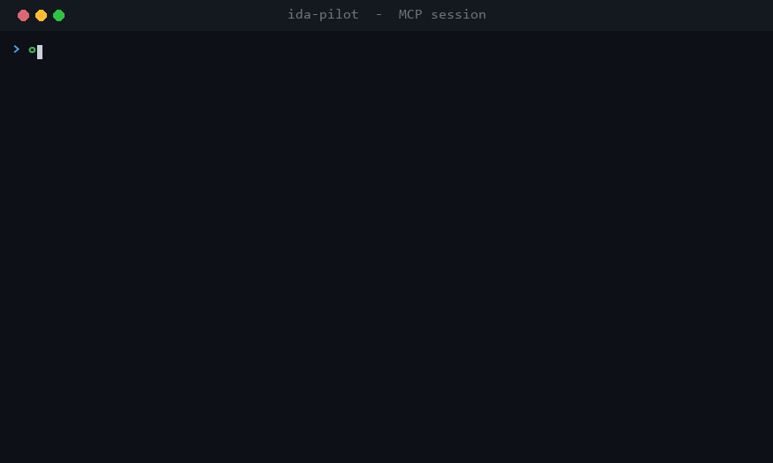
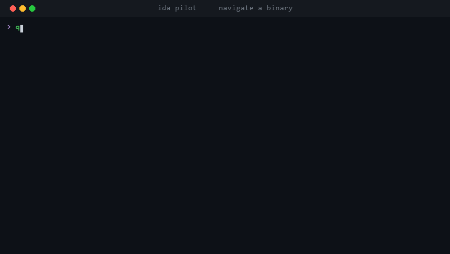
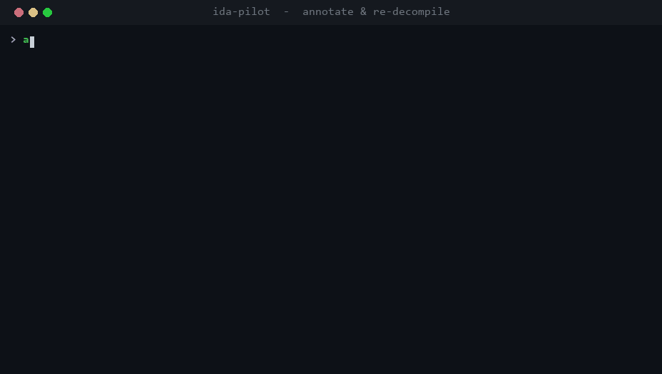

# IDA Pilot

[](https://github.com/wklwkl115/ida-pilot/actions/workflows/verify.yml)
[](LICENSE)


> Drive IDA Pro's decompiler and disassembler from an AI agent over the Model Context Protocol — headless, fast, and token-frugal.



Headless IDA Pro analysis server exposing MCP tools (28 with `py_eval` enabled, 27 without). Designed for AI agents — tiered tool loading, multi-layer caching, batch operations, and compact payloads minimize token cost per turn.

Go orchestrates sessions and caching. Python workers run IDA via idalib. Communication uses Connect RPC over TCP.

## Why IDA Pilot?

- **Built for agents, not humans.** Every response is compact — hex addresses, sparse fields, `[address, type]` xref tuples, `"ok"` instead of `{"success": true}` — to spend the fewest tokens per turn.
- **One call, not ten.** Composite tools like `survey_binary` and `analyze_function` return decompilation + metadata + xrefs + comments in a single round-trip; `analyze_functions` batches up to 10 at once.
- **Stays responsive on huge binaries.** Loading and auto-analysis run detached with a live progress heartbeat, so a 200 MB binary won't stall or time out your MCP client — you poll until `ready=true` and keep working.
- **Tiered tool surface.** Agents boot with 3 tools; read/analysis and write tools promote in as the workflow advances, keeping the per-turn schema small.
- **Multi-binary.** Open several databases and `cross_reference` / `cross_search` across them.
- **Safe by default.** Loopback-only bind, `py_eval` off, `Origin`/`Host` guard, optional path allowlist (details below).

## ⚠️ Security model — read before exposing the port

IDA Pilot has **no built-in authentication**. The defaults are tuned for a single trusted MCP client on the same machine:

- **Bound to `127.0.0.1` by default.** Only callers on the local host can reach it. Override with `--bind 0.0.0.0` (or `IDA_PILOT_BIND`) only if you are putting an authenticated reverse proxy in front.
- **`Origin` / `Host` validation** on every request when bound to loopback — blocks DNS-rebinding and browser cross-origin attacks.
- **`py_eval` is OFF by default.** It runs arbitrary Python inside the IDA worker (full host filesystem + network access). Enable explicitly with `--enable-py-eval` (or `IDA_PILOT_ENABLE_PY_EVAL=1`) and treat the resulting endpoint as an RCE primitive — anyone who can reach the port can execute code.
- **Filesystem allowlist (opt-in).** By default a client can open any file the server user can read (`open_binary`, `import_metadata`). Set `--allowed-roots` (or `IDA_PILOT_ALLOWED_ROOTS`) to confine those paths to specific directories — recommended whenever you expose the port. Paths are symlink-resolved before the check, so a link inside a root can't escape it.

The truncated-output cache (`get_cached_output`) is process-global with no per-session ACL — the server has no client identity to bind entries to — so access rests on unguessable 128-bit cache IDs plus the loopback/Origin guards above, not on session ownership.

In short: **a fresh `./bin/ida-pilot` run is safe to leave on; opening the port to the network or enabling `py_eval` is an explicit choice and your responsibility to protect.**

## Architecture

```
MCP Client (Claude, Cursor, etc.)
    │
    │  Streamable HTTP / SSE
    ▼
Go Server (:17300)
    │  session registry, tool tiers, caching, output pagination
    │
    │  Connect RPC (TCP)
    ▼
Python Worker (one per binary)
    │  idalib + Hex-Rays decompiler
    ▼
IDA database (.i64)
```

## Quick Start

### Prerequisites

- **IDA Pro 9.0+** with idalib activated ([docs](https://docs.hex-rays.com/user-guide/idalib))
- **Go 1.25+**
- **Python 3.10+** (the supported floor; CI and `mise` pin 3.12)

### Build

```bash
git clone https://github.com/wklwkl115/ida-pilot.git
cd ida-pilot
pip install -r python/requirements.txt
go build -o bin/ida-pilot ./cmd/ida-pilot
```

### Run

```bash
./bin/ida-pilot --debug
```

The server listens on `http://localhost:17300/` (Streamable HTTP) and `http://localhost:17300/sse` (SSE fallback).

### Connect an MCP Client

Add to your MCP client configuration:

```json
{
  "mcpServers": {
    "ida-pilot": {
      "type": "http",
      "url": "http://127.0.0.1:17300/"
    }
  }
}
```

**Claude Desktop:** `~/Library/Application Support/Claude/claude_desktop_config.json` (macOS) or `%APPDATA%\Claude\claude_desktop_config.json` (Windows)

**Claude Code:** `.mcp.json` in project root or `~/.claude/settings.json`

**Cursor:** `.cursor/mcp.json` in project root

## Agent-Optimized Design

IDA Pilot is built for agents, not humans. Every design decision targets lower token cost and fewer round-trips.

### Tiered Tool Loading

Agents start with 3 tools. More appear as needed — the schema payload per turn stays small.

| Tier | Trigger | Tools | Purpose |
|------|---------|-------|---------|
| 0 | Server boot | 3 | `open_binary`, `list_sessions`, `get_cached_output` |
| 1 | Binary opened | +19 = 22 | Read, query, composite, analysis, context & cross-session tools |
| 2 | First analysis | +5 = 27 | Write, annotate, and import tools |

When the last session closes, tools demote back to Tier 0. Adding `--enable-py-eval` registers one more Tier-1 tool, taking the full surface to 28.

### Composite Tools

One call replaces many. These are the primary entry points for analysis:

- **`survey_binary`** — segments, function/import/export/string counts with top entries, entry point, decompiler status. One call to orient.
- **`analyze_function`** — pseudocode + metadata + xrefs + comments for a single function. All cached.
- **`analyze_functions`** — batch-analyze up to 10 functions in parallel.
- **`annotate_function`** — batch rename, retype, and comment in a single call per function.

### Multi-Layer Caching

| Cache | Scope | Capacity | Invalidation |
|-------|-------|----------|--------------|
| List (functions, imports, exports, strings) | Session | Unbounded | rename / make_function |
| Decompilation (pseudocode) | Per-function | 200 entries | targeted: function renames invalidate only that function; data-label renames search and evict only entries containing the old name; lvar/comments invalidate that function |
| Xrefs (to + from) | Per-address | Unbounded | make_function |
| Segments | Session | Static | Never |
| Output (truncated responses) | Global | 200 entries, 1h TTL | FIFO eviction |
| Analysis context (visited + notes) | Session | Unbounded | Never |

Background cache warming starts automatically when a binary is opened — `survey_binary` returns instantly on its first call.

### Compact Payloads

- Addresses are hex (`0x...`) on both input and output, so the agent pastes back exactly what it sees in disassembly/listings (decimal is also accepted on input)
- Sparse fields: zero/false/empty values omitted
- Xrefs as `[address, type]` tuples instead of objects
- Write operations return `"ok"` instead of `{"success": true}`
- Responses over 8KB auto-truncated with pagination via `get_cached_output`
- Session ID auto-detected when only one session is active

### Analysis Context

Agents lose context on long conversations. IDA Pilot tracks it server-side:

- **`set_analysis_note`** — attach notes to addresses during analysis
- **`get_analysis_context`** — retrieve all visited functions and notes to recover state

## Tools Reference

The surface is intentionally small: related operations are consolidated behind a few dispatcher tools that take a discriminator field (`category`, `mode`, `action`, `target`, `format`). 28 tools across three tiers.

### Session & lifecycle (Tier 0–1)

| Tool | Description |
|------|-------------|
| `open_binary` | Open a binary. Returns immediately; loads + auto-analyzes in the background |
| `close_binary` | Close session and save database |
| `save_database` | Save without closing |
| `list_sessions` | List active sessions |
| `get_session_progress` | Load/analysis progress and readiness — poll until `ready=true` |
| `get_cached_output` | Paginate a truncated response via its `_cache_id` |

`open_binary` does not block: loading and auto-analysis run in a background worker thread so the call returns at once (large binaries take minutes to analyze). Poll `get_session_progress` until `ready=true` before issuing analysis tools — they are gated and return a `not ready` error until then. Status RPCs stay responsive throughout because the worker serializes IDA access on a single thread while answering progress queries from cached state.

### Composite (Tier 1)

| Tool | Description |
|------|-------------|
| `survey_binary` | Full binary overview in one call |
| `analyze_function` | Decompile + metadata + xrefs + comments for one function |
| `analyze_functions` | Batch-analyze up to 10 functions; per-item errors so one bad address won't fail the batch |

### Read & query (Tier 1)

| Tool | Description |
|------|-------------|
| `query` | Browse by `category`: functions, imports, exports, strings, globals, segments, structs, enums, entry_point. Regex, pagination, and category filters (`named_only`, `module`, `name`) |
| `get_references` | Cross-references. `mode`=code (`direction`=to/from/both), data, or string |
| `search` | `mode`=text (`needle`) or binary (IDA `pattern`), over a `start`/`end` range |
| `inspect` | Name + type + comment + function bounds + instruction length at an address |
| `get_disasm` | Disassembly at an address, or the whole function |
| `read_memory` | Raw memory: `format`=bytes/dword/qword/byte/string |



### Cross-session (Tier 1)

| Tool | Description |
|------|-------------|
| `cross_reference` | Look up a symbol from one binary (`source_session_id` + `address`) and find where it appears in another (`target_session_id`) — searches imports, exports, function names, and strings |
| `cross_search` | Search across multiple sessions at once. `mode`=functions/imports/exports/strings, regex or exact needle. Omit `session_ids` to search all active sessions |

### Analysis control & context (Tier 1)

| Tool | Description |
|------|-------------|
| `run_auto_analysis` | Trigger IDA auto-analysis (for binaries opened with `skip_analysis`). Returns once analysis finishes, or — for a long analysis that outlasts the call — promptly with `status:"analyzing"` while it continues in the background; poll `get_session_progress` until `ready=true` |
| `watch_auto_analysis` | Observe auto-analysis progress (does not drive or cancel it) |
| `set_analysis_note` / `get_analysis_context` | Server-side context tracking for state recovery |
| `prune_context` | Clear cached outputs + noted-function caches to free memory |
| `py_eval` *(opt-in)* | Execute Python in IDA — registered only with `--enable-py-eval`. Invalidates caches after each call (`read_only=true` to keep them warm). See [Security model](#%EF%B8%8F-security-model--read-before-exposing-the-port). |

### Write & import (Tier 2)

| Tool | Description |
|------|-------------|
| `annotate_function` | Batch rename + retype + comment for a function → returns updated pseudocode |
| `set_metadata` | `action`=set_name, delete_name, or set_comment (`scope`=address/function/decompiler) |
| `set_type` | `target`=function (prototype), global (C type), or lvar (C type + `function_address` + `lvar_name`) |
| `make_function` | Create a function at an address |
| `import_metadata` | `format`=il2cpp (script.json + il2cpp.h) or flutter (flutter_meta.json) |



## Configuration

### CLI Flags

```
--bind              Bind interface (default 127.0.0.1; use 0.0.0.0 only behind an auth proxy)
--port              HTTP port (default: from config.json)
--config            Config file path (default: config.json)
--worker            Python worker script path
--max-sessions      Max concurrent sessions
--session-timeout   Session idle timeout (e.g. 4h)
--debug             Verbose logging
--enable-py-eval    Register the py_eval tool (arbitrary Python in the IDA worker — RCE primitive)
--allowed-roots     Restrict agent-supplied paths to these dirs (OS-path-list separated; empty = unrestricted)
```

### Environment Variables

```
IDA_PILOT_BIND=127.0.0.1
IDA_PILOT_PORT=17300
IDA_PILOT_SESSION_TIMEOUT_MIN=240
IDA_PILOT_MAX_SESSIONS=10
IDA_PILOT_WORKER=/path/to/worker.py
IDA_PILOT_DEBUG=1
IDA_PILOT_ENABLE_PY_EVAL=0
IDA_PILOT_ALLOWED_ROOTS=/srv/samples:/data/binaries   # OS-path-list separated; empty = unrestricted
```

### config.json

```json
{
  "bind": "127.0.0.1",
  "port": 17300,
  "session_timeout_minutes": 240,
  "max_concurrent_sessions": 4,
  "database_directory": "./databases",
  "python_worker_path": "python/worker/server.py",
  "debug": false,
  "enable_py_eval": false,
  "allowed_roots": []
}
```

## Development

```bash
make build          # Build server
make test           # Run tests
make proto          # Regenerate protobuf (requires protoc)
make clean          # Clean artifacts
make inspector      # Launch MCP Inspector at localhost:5173
```

### Project Structure

```
ida-pilot/
├── cmd/ida-pilot/        # Server entry point
├── internal/
│   ├── server/           # MCP tool handlers, caching, tiers
│   ├── session/          # Session registry + persistence
│   └── worker/           # Python worker process manager
├── proto/                # Protobuf service definitions
└── python/worker/        # idalib wrapper + Connect RPC server
```

## Contributing

Contributions are welcome — see [CONTRIBUTING.md](CONTRIBUTING.md) for setup, the
local test gates, and conventions. To report a security issue privately, see
[SECURITY.md](SECURITY.md).

## License

MIT
